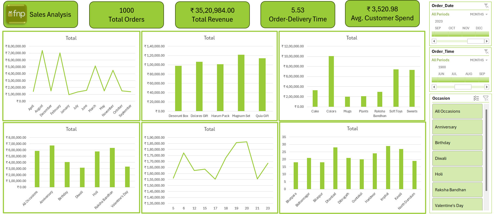

# Ferns N Petals (FNP) Sales Analysis Dashboard

A comprehensive data analytics and visualization project evaluating sales performance, customer purchasing behavior, and delivery logistics for an e-commerce gifting platform (FNP). This project leverages Excel to transform raw transactional data into actionable business insights.

---

## 📊 Dashboard Preview

*(Ensure your dashboard image file is named `dashboard.png` and placed in the root directory of your repository to display it here)*

---

## 🎯 Project Overview & Objective
The goal of this project is to analyze a dataset of 1,000 orders to uncover trends that drive growth, optimize delivery timelines, and improve marketing campaign targeting. 

### Key Business Questions Addressed:
1. Which months and seasonal occasions generate the highest revenue?
2. What are the top-performing product categories and specific items?
3. Is there a correlation between ordered quantities and delivery delays?
4. How is customer spending distributed across different geographies and demographics?

---

## 🗂️ Dataset Architecture
The project structure relies on a relational database design split across four core sheets/tables:

* **Orders Table (`Orders.csv`):** Transaction details including `Order_ID`, `Quantity`, `Order_Date`, `Location`, `Occasion`, and calculated fields like `Revenue` and `diff_delivery_order` (delivery duration in days).
* **Customer Table (`Customer.csv`):** Demographics including `Customer_ID`, `City`, `Gender`, and contact profiles.
* **Products Table (`Products.csv`):** Product attributes such as `Product_ID`, `Product_Name`, `Category`, `Price (INR)`, and assigned `Occasion`.
* **Pivot Tables (`Pivot Tables.csv`):** Aggregated data matrices utilized to construct dashboard visuals and conduct correlation tests.

---

## 📈 Key Insights & Findings

### 1. Revenue & Seasonal Trends
* **Total Revenue Generated:** ₹3,520,984 across 1,000 distinct orders.
* **Peak Sales Months:** **August** (₹737,389) and **February** (₹704,509) emerge as massive revenue outliers, heavily driven by seasonal gifting occasions like Raksha Bandhan and Valentine's Day.
* **Low Seasons:** January and July exhibit the lowest demand, dropping below ₹100,000–₹140,000 respectively.

### 2. Product Performance
* **Top 5 Revenue Generating Products:**
    1. *Magnam Set* (₹121,905)
    2. *Quia Gift* (₹114,476)
    3. *Dolores Gift* (₹106,624)
    4. *Harum Pack* (₹101,556)
    5. *Deserunt Box* (₹97,665)

### 3. Delivery Logistics Performance
* **Average Fulfillment Window:** **5.53 days** from order placement to customer doorstep.
* **Quantity vs. Delivery Time Correlation:** A statistical correlation analysis yields a coefficient of **0.0034** (Neutral / Near Zero). This proves that larger bulk orders do *not* experience structural shipping bottlenecks compared to single-item orders.

---

## 🛠️ Data Engineering & Features Used
This project highlights advanced Excel capabilities, including:
* **Data Cleaning:** Handling missing attributes, correcting text casing for cities, and restructuring date/time strings.
* **Advanced Formulas:** Implementation of `VLOOKUP`/`XLOOKUP`, `TEXT()` conversions for dates, and math/logical functions to derive total revenue (`Quantity * Price`).
* **Statistical Analysis:** `CORREL` functions to analyze logistic efficiency behavior.
* **Dynamic Pivot Tables & Slicers:** Interactive filtering by Month, Occasion, Region, and Product Category for real-time visualization changes.

---
